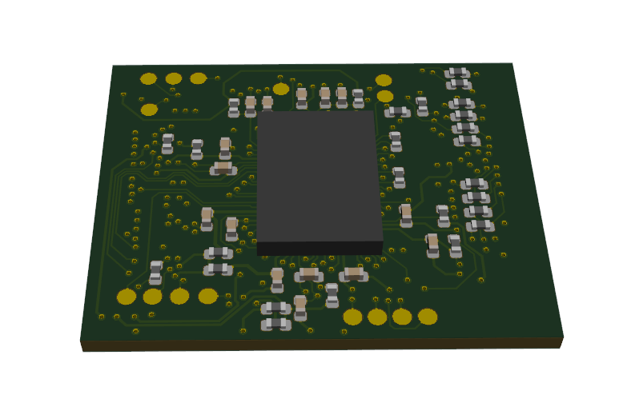

GEM1 Adapter
============

This repository contains PCB design files for adapter board accommodating a GEM1 chip prepared jointly by `zGlue <http://zglue.com>`_ company and `Antmicro <http://www.antmicro.com>`_.
The GEM1 design utilizes chiplet technology and has been prepared using a zGlue ChipBuilder tool. The design has been produced as a single integrated circuits in LGA-96 package.

The GEM1 chip includes the following components placed on dynamically reconfigurable interposer:

* 2x Lattice ``ICE40UP5K-UWG30ITR`` FPGAs used exclusively for processing and system control
* 32Mbit SPI FLASH memory
* 10-channel DPDT MIPI switch allowing to connect a 2-lane MIPI CSI-2 interface either to the processing FPGA or to external output (pass-through mode)
* 12MHz system clock generator 
* Internal LDOs and power management unit maintaining 1V2, 1V8, 2V5, 3V3 system supplies

The chip is supplied from a single voltage ``VUSB`` of 5 VDC.
The actual configuration of the system included inside GEM1 zip strongly depends on the configuration routing file that is uploaded to the ``Smart fabric`` interposer.
Also the pin functions of the LGA package may vary depending on the uploaded routing file.
The board break-routes signals for MIPI CSI-2 interfaces (Input and Output) along with inernal flash and FPGA configuration interfaces, control signals and power supplies.
